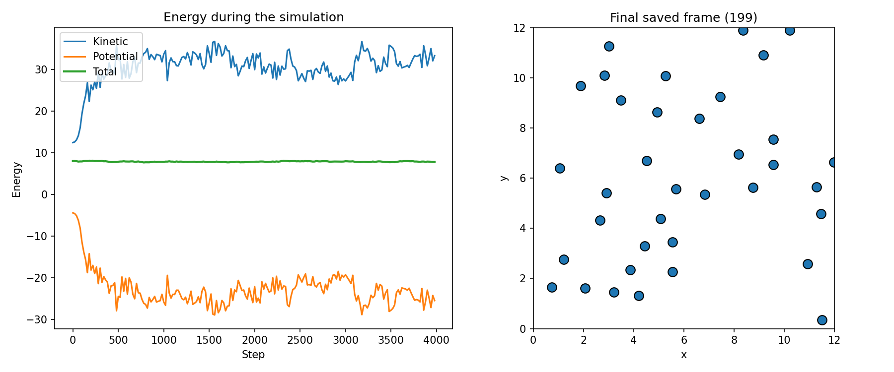

# Molecular Dynamics Projects in C++

This repository contains three small projects I made while learning C++ for molecular dynamics and computational physics.

The projects start with a simple Lennard-Jones simulation, then improve the force calculation with a cell list, and finally use the same ideas in a 3D reverse non-equilibrium molecular dynamics (NEMD) calculation for thermal conductivity.

My main goal was not to build a production-level MD package. I wanted to understand the important steps myself: how particles are stored, how forces are calculated, how periodic boundaries work, how trajectories are integrated, and how simulation results can be checked.

## Projects

### 1. 2D Lennard-Jones molecular dynamics

Folder: [`01-lennard-jones-md`](01-lennard-jones-md)

I started with a small 2D system of 36 particles. The particles interact through the Lennard-Jones potential and move inside a periodic square box.

What I practiced:

- Lennard-Jones pair forces
- periodic boundary conditions
- minimum-image convention
- velocity-Verlet integration
- kinetic, potential, and total energy
- writing trajectory and CSV files from C++
- plotting the results with Python

The saved example run contains 4000 integration steps and 200 stored trajectory frames.



The total energy in the supplied example changes from about `8.007` to `7.794`, or about `2.7%`. This is a simple learning model with a finite time step and a hard interaction cutoff, so I treat the energy plot as a sanity check rather than claiming perfect conservation.

### 2. Cell-list force optimization

Folder: [`02-cell-list-benchmark`](02-cell-list-benchmark)

The first project checks every particle pair. That is easy to understand, but the cost grows approximately as `O(N^2)`.

In the second project I divide the simulation box into cells. A particle only needs to search its own cell and nearby cells because particles farther than the cutoff cannot interact.

The program first compares the direct and cell-list forces on exactly the same configuration. It only starts the timing benchmark if the two methods agree within a small floating-point tolerance.

At fixed density and cutoff, this changes the practical scaling toward approximately `O(N)` because the average number of nearby particles does not grow with the total system size.

### 3. 3D reverse-NEMD thermal conductivity

Folder: [`03-reverse-nemd`](03-reverse-nemd)

The third project extends the ideas to a 3D Lennard-Jones fluid and follows the reverse NEMD method proposed by Florian Müller-Plathe.

The box is divided into slabs. During the production run, velocity vectors are exchanged between selected particles in a cold slab and a hot slab. This imposes a heat flux. The program then measures the temperature profile and estimates thermal conductivity from Fourier's law.

This is an educational, reduced-size implementation. It uses the published reference state point `rho* = 0.849`, `T* = 0.7`, and cutoff `3.0 sigma`, but it does not reproduce every detail of the original simulation cell or run length.

## Repository structure

```text
molecular-dynamics-cpp/
├── README.md
├── REFERENCES.md
├── requirements.txt
├── .gitignore
├── 01-lennard-jones-md/
│   ├── README.md
│   ├── src/
│   │   └── lj_md_simulation.cpp
│   ├── scripts/
│   │   └── plot_trajectory.py
│   └── results/
│       ├── energy.csv
│       ├── trajectory.xyz
│       └── md_summary.png
├── 02-cell-list-benchmark/
│   ├── README.md
│   ├── src/
│   │   └── neighbor_list_benchmark.cpp
│   └── results/
└── 03-reverse-nemd/
    ├── README.md
    ├── src/
    │   └── nemd_thermal_conductivity_3d.cpp
    └── results/
```

## Tools used

- C++17
- GCC / `g++`
- Python 3
- pandas
- matplotlib
- Visual Studio Code for editing and running the programs

## What I learned

These projects helped me connect basic C++ programming with molecular simulation. The most useful parts for me were:

1. breaking a simulation into small functions instead of writing everything inside `main()`;
2. understanding why periodic boundaries are needed for a bulk-like system;
3. seeing how the same Lennard-Jones force calculation becomes expensive as the number of particles grows;
4. checking an optimized algorithm against a simple reference method before trusting its speed;
5. learning how a non-equilibrium temperature gradient can be used to estimate a transport property.

## Important note

These programs are learning implementations, not replacements for established molecular-dynamics packages such as LAMMPS, GROMACS, or HOOMD-blue. For research-quality work, convergence with respect to system size, time step, cutoff treatment, equilibration time, production length, uncertainty, and finite-size effects would need to be studied more carefully.

## References

The main scientific sources used for the methods are listed in [`REFERENCES.md`](REFERENCES.md). Each project README also explains which references are directly relevant to that project.
